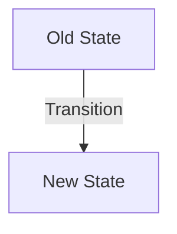

<!--
STRICT PROTOCOL ENFORCED
Read CONTRIBUTING.md before submitting.
-->

## CONTEXT & RATIONALE
<!-- Why is this change necessary? Link to the issue or research paper. -->

## ARCHITECTURAL CHANGES
<!-- 
MANDATORY for Kernel/Circuits changes. 
Use MermaidJS to visualize the data flow or state change. 
-->

## VISUAL EVIDENCE / ARTIFACTS
<!-- 
HIGHLY RECOMMENDED. 
Attach a video, GIF, or Screenshot of the feature in action.
Capture the "vibe" of the change. 
-->

## VERIFICATION STRATEGY
<!-- How did you verify this? Unit tests? Integration tests? Formal verification? -->
- [ ] Unit Tests Passed
- [ ] Linting / Formatting Checked
- [ ] Manual Verification (describe below)

## RISK ASSESSMENT
<!-- Does this affect consensus? Encryption? PII? Be honest. -->