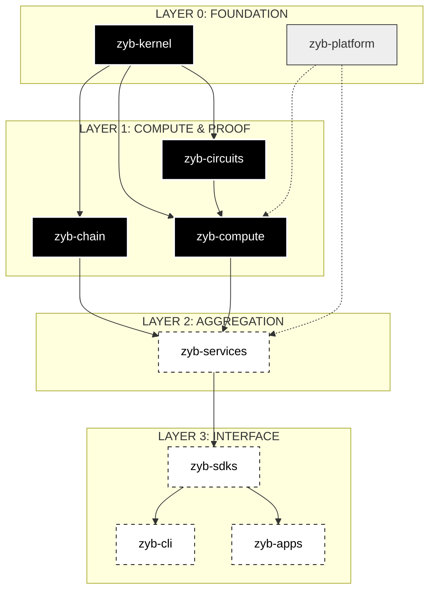

# Z Y B . L A B S

**COMPUTATION // CRYPTOGRAPHY // CHAOS THEORY**

[ ACCESS MOTHER REPOSITORY ](https://github.com/8ctag0n)

---

### [ ORDER FROM CHAOS ]

## SYSTEM ARCHITECTURE MIGRATION : STATUS REPORT

The ZYB ecosystem has transitioned from a monolithic repository to a decentralized multi-repo architecture. This strategic fragmentation is designed to minimize cognitive load, enforce modular boundaries, and optimize developer ergonomics.

**RATIONALE:** High-performance systems require extreme decoupling. By isolating primitives from interfaces, we achieve higher security audits and parallelized research velocity.

---

## SYSTEM TOPOLOGY

---

## CORE STACK (V2.0)

### INFRASTRUCTURE & PRIMITIVES

| REPOSITORY | CLASSIFICATION | DOMAIN |
| :--- | :--- | :--- |
| **zyb-kernel** | RUST CORE | Crypto primitives, FHE logic, job scheduling, base types. |
| **zyb-circuits** | ZK-SYSTEMS | Blind signatures, Market logic, Proof of Innocence (PoI). |
| **zyb-compute** | PROVING LAYER | Prover infrastructure, FHE execution, Halo2 integration. |

### INTEROPERABILITY & CLOUD

| REPOSITORY | CLASSIFICATION | DOMAIN |
| :--- | :--- | :--- |
| **zyb-chain** | CROSS-CHAIN | Adapter layer for Aptos, Solana, and Starknet. |
| **zyb-services** | BACKEND | Blink-server, public-api, and secure witness-storage. |
| **zyb-platform** | OPS | Docker orchestration, CI/CD, and deployment infra. |

### CONSUMER & DEV-TOOLS

| REPOSITORY | CLASSIFICATION | DOMAIN |
| :--- | :--- | :--- |
| **zyb-sdks** | LIBRARIES | DeFi, Governance, Identity, and TypeScript SDKs. |
| **zyb-apps** | INTERFACES | Wallet-extension, WebApp, and Design-System. |
| **zyb-cli** | AUTOMATION | Command Line Interfaces for ecosystem management. |

---

EST 2026. ENGINEERED IN LINUX. POWERED BY RUST.

---

## TRANSMISSIONS

> **[2026-01-01] :: SYSTEM_RESTRUCTURE_COMPLETE**
> Multi-repo architecture is now live. All core vectors have been decoupled.
> [ ACCESS LOG : 001 ](https://github.com/8ctag0n/.github/blob/main/logs/2026-01-01-genesis.md)

> **[RESEARCH NOTE]**
> Ongoing investigation into FHE-based 'Proof of Innocence' for Zcash-style networks. 

